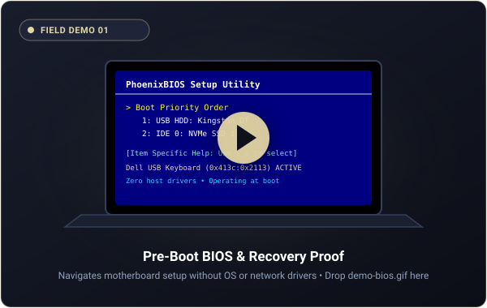
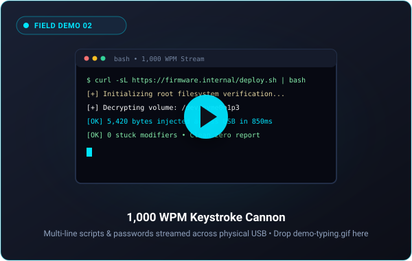
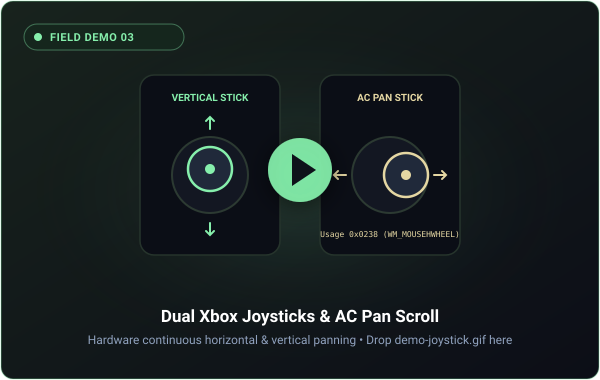
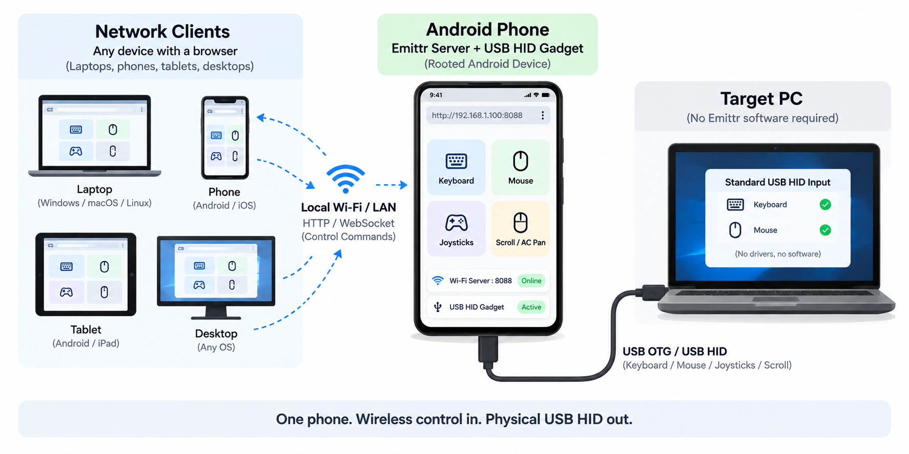

<div align="center">

```
███████╗███╗   ███╗██╗████████╗████████╗██████╗ 
██╔════╝████╗ ████║██║╚══██╔══╝╚══██╔══╝██╔══██╗
█████╗  ██╔████╔██║██║   ██║      ██║   ██████╔╝
██╔══╝  ██║╚██╔╝██║██║   ██║      ██║   ██╔══██╗
███████╗██║ ╚═╝ ██║██║   ██║      ██║   ██║  ██║
╚══════╝╚═╝     ╚═╝╚═╝   ╚═╝      ╚═╝   ╚═╝  ╚═╝
```

# Your phone just clocked in as a keyboard.

### *Hardware USB HID Deck • Ghost Keystrokes • Local Network Air-Gap Relay*
**Turn any rooted Android or NetHunter phone into an unapologetic hardware-grade USB keyboard, precision trackpad, and continuous scrolling deck.**

[](https://github.com/mr-anjaneyam/Emittr/releases)
[](LICENSE)
[](https://docs.kernel.org/usb/gadget_configfs.html)
[](https://mr-anjaneyam.github.io/Emittr/)
[](CONTRIBUTING.md)

<br/>

> **Plug your rooted phone into anything with a USB port.** Then type directly from its screen, or open Emittr in your browser on any laptop or phone on your local Wi-Fi. Keystrokes stream over the air and strike the host as real hardware signals: **no drivers, no host software, completely air-gap safe.**

<br/>

| ⚡ 0 Host Software / Agents | 🛡️ 0 Host Clipboard Writes | 🚀 Sub-5ms Hardware Delivery | 🖥️ Pre-Boot BIOS & UEFI Ready |
|:---:|:---:|:---:|:---:|

<br/>

[🎬 Video Demos](#-field-demos-in-action) • [🧱 The Wall (Why Emittr)](#-the-wall-locked-down-means-locked-down) • [⚡ The Two Superpowers](#-the-two-superpowers-how-emittr-operates) • [🎯 Missions](#-missions--real-world-use-cases) • [🔥 Features](#-the-feature-arsenal) • [🕹️ Joysticks & AC Pan](#4-🕹️-dual-xbox-thumbsticks--native-ac-pan-scrolling) • [🚀 Quick Start](#-quick-start-zero-to-hero-in-2-minutes) • [💻 CLI Commands (`emittr`)](#-command-line-control-emittr--usbtype) • [📱 Device Compatibility](#-hardware-compatibility-roster) • [🤝 Contributing](CONTRIBUTING.md)

</div>

---

## 🧱 The Wall: Locked Down Means Locked Down

When you are standing in front of a restricted workstation, a hardened server, or an air-gapped machine, traditional software tools hit a brick wall:

| Access Vector | The Locked-Down Enterprise State | The Emittr Reality |
|---|---|---|
| 💾 **USB Storage** | ❌ Blocked by endpoint policy / GPO | **No storage device mounted.** Leaves a spotless forensic audit trail. |
| 📋 **The Clipboard** | ❌ Disabled, monitored, or scraped by DLP / EDR | **0 clipboard writes.** Secret never touches host clipboard memory. |
| 🌐 **Remote Software** | ❌ Blocked by firewalls, proxies, or missing OS | **0 host software.** Requires zero background `.exe` or agent on the target. |
| 🔌 **The Network** | ❌ Air-gapped, isolated, or dead NIC | **Pure physical USB cable.** Completely air-gap compliant. |
| ⌨️ **A Physical Keyboard** | 🟢 **Allowed. Always. Nobody blocks a keyboard.** | **Speaks standard USB-IF HID scancodes natively.** |

```
                       "Nobody blocks a keyboard."
                                    ↓
                 So we taught a phone to become one:
         A real USB keyboard • A five-button precision mouse
      Two Xbox thumbsticks • And a local network air-gap bridge
```

---

## 🎬 Field Demos in Action

*See Emittr operating across real hardware, bootloaders, and locked-down environments.*

<div align="center">

| 1️⃣ BIOS & Pre-Boot Control | 2️⃣ 1,000 WPM Keystroke Cannon | 3️⃣ Dual Xbox Joysticks & AC Pan |
|:---:|:---:|:---:|
| <a href="#-field-demos-in-action"></a><br/><sub>*(Drop `demo-bios.gif` into `docs/`)*</sub> | <a href="#-field-demos-in-action"></a><br/><sub>*(Drop `demo-typing.gif` into `docs/`)*</sub> | <a href="#-field-demos-in-action"></a><br/><sub>*(Drop `demo-joystick.gif` into `docs/`)*</sub> |
| **Pre-Boot Hardware Proof** | **Lightning Script Injection** | **Hardware Horizontal Pan** |
| Navigates motherboard BIOS & GRUB setup menus. Proves real physical USB HID before the OS or drivers boot. | Fires long shell commands, passwords, and multi-line scripts at 1,000 WPM with abort safety. | True hardware AC Pan (`Usage 0x0238`) gliding across wide codebases and Excel spreadsheets. |

</div>

<details>
<summary><b>📖 Detailed breakdown of each demonstration</b></summary>

1. **Demo 1: The Pre-Boot BIOS & Recovery Proof**
   * **What it proves:** Unlike software apps (KDE Connect, Unified Remote, TeamViewer), Emittr requires zero host OS or driver stack. It functions at the raw motherboard USB controller level, enabling headless recovery, BIOS configuration, and GRUB kernel selection.
2. **Demo 2: The 1,000 WPM Keystroke Cannon**
   * **What it proves:** Delivers bulk payloads with selectable speeds (Instant `5ms` down to Human `60ms`), pre-flight countdown buffers, and an instant kill switch if an input buffer lags.
3. **Demo 3: Dual Xbox Thumbsticks & Hardware AC Pan**
   * **What it proves:** Instead of fake `Shift + Scroll` synthetic combos, Emittr dispatches genuine USB-IF Consumer Usage `0x0238` packets that Windows, macOS, and Linux natively process as `WM_MOUSEHWHEEL`.
</details>

---

## ⚡ The Two Superpowers: How Emittr Operates

Emittr adapts to your physical operating environment with two distinct superpowers:

<p align="center">
  
</p>


### 🔴 Superpower 01: Hardware USB HID (The Handheld Cyberdeck)
*Paste ➔ Keystrokes. Master password. Zero clipboard.*
* **How it works:** Hold your rooted phone in your hand as a standalone, tactile cyberdeck plugged directly into the target machine via a standard USB-OTG cable.
* **Why it matters:** Zero network connectivity is involved. Because it speaks native USB Boot Protocol scancodes, it works before the operating system even boots - navigate motherboard BIOS/UEFI menus, select GRUB kernels, unlock LUKS disk encryption, or recover headless servers.
* **The Keystroke Cannon:** Paste a 50-line PowerShell script, base64 payload, or complex credential and fire it into the machine at 1,000 WPM with sub-5ms latency.

### 🔵 Superpower 02: The Local Network Relay (The Air-Gap Bridge)
*Type from any machine. Anywhere on your Wi-Fi.*
* **The Missing Link Problem:** Your master credentials, Bitwarden vault, and 2FA authenticator live on your personal daily driver (iPhone, Pixel, Mac) - **not** on the rooted lab phone plugged into the server rack or client workstation.
* **How it works:** Leave your rooted phone connected to the target machine via USB as a silent hardware bridge. Open `http://<phone-ip>:8088` from your personal phone or laptop browser on the local Wi-Fi.
* **The Magic:** Copy a password on your personal iPhone, tap **Stream to Wire**, and Emittr bridges the data across the local WebSocket and injects it straight into the target PC as physical electrical keystrokes.
* **Air-Gap Safe:** The target machine never touches your Wi-Fi, never mounts a network drive, and its clipboard is never modified.

---

## 🎯 Missions & Real-World Use Cases

*When a network is locked down, a driver is missing, or a keyboard has failed - real hardware still works. Here are the six places software gives up:*

| Mission / Scenario | The Field Challenge | How Emittr Solves It |
|---|---|---|
| 🏢 **1. The Restricted Workstation** | Corporate laptops lock down USB mass storage, restrict clipboard sync, and block personal webmail. | **Bypasses restrictions without violating policy.** Standard USB keyboards are universally allowed. Type scripts or text from your phone as genuine Dell USB keystrokes with zero software footprint. |
| 📲 **2. The Daily-Driver Relay** | Your master credentials and 2FA tokens live in your personal phone's vault (Bitwarden, 1Password) - not on the rooted lab phone plugged into the PC. | **Hardware bridge over local Wi-Fi.** Leave the rooted phone plugged in as an air-gap bridge. Open Emittr's web deck from your personal phone over Wi-Fi, copy from your mobile vault, and stream it across the physical cable. |
| 🔬 **3. Clean-Room Diagnostics** | Working on quarantined, isolated, or air-gapped systems under strict forensic audit rules where mounting USB drives or installing tools is forbidden. | **Zero forensic footprint.** Feeds triage scripts, memory collection commands, and system queries strictly through keystrokes. No storage device is mounted, leaving a spotless audit trail. |
| 🔑 **4. Zero-Trace Credentials** | Typing a 64-character master password, BitLocker key, or PGP secret on a client workstation risks exposure to clipboard scrapers, EDR monitors, or browser extensions. | **Host clipboard is never touched.** Your secret stays safe inside your mobile device and streams straight into the target password field as raw USB scancodes. Clipboard monitors see nothing. |
| 🖥️ **5. The BIOS Navigator** | A headless home server, a Raspberry Pi, or a laptop with a dead keyboard stuck in the BIOS setup, UEFI boot menu, or GRUB prompt before the OS or network stack loads. | **Firmware speaks Boot Protocol.** Emittr emulates standard USB Boot Protocol scancodes that motherboard firmware listens to natively. Navigate boot menus and recovery prompts with full arrow-pad controls. |
| 🧰 **6. Field Tech Pocket Console** | Digital signage mounted 12 feet up, or interactive kiosks sealed behind glass with only a single dangling USB maintenance cable. | **Instant full-stack peripheral.** Plug the phone you are already carrying into the dangling cable. Full virtual trackpad, keyboard, emergency unstick button, and dual Xbox scroll joysticks in the palm of your hand. |

---

## 🧐 Why Emittr? (The Reality Check)

Ever tried controlling a PC with those sketchy Wi-Fi mouse apps from the Play Store? You install a random `.exe` server on your laptop, fight Windows Firewall, deal with 200ms lag, and pray it doesn’t leak your keystrokes to a random cloud server.

Or maybe you tried a BadUSB rubber ducky, but it’s completely blind, fires once, and if your machine lags for half a second, the entire payload types into Notepad instead of PowerShell.

**Emittr does things the right way:** it uses your phone's USB-OTG port and kernel `configfs` to disguise your phone as a **genuine, physical Standard USB Keyboard & Mouse**.

| Feature | Software Wi-Fi / Bluetooth Apps | Blind USB Keystroke Sticks | Emittr v2.0.0 ⚡ |
|---|---|---|---|
| **Host PC Setup** | Needs client `.exe` / drivers | None (blind flash drive) | **Zero host install.** Works on BIOS, Windows, Mac, Linux, PS5. |
| **Network Dependency** | Needs shared Wi-Fi / pairing | None | **Pure physical USB cable.** Air-gapped workstations rejoice. |
| **Interactive Control** | Laggy & unreliable | ❌ Impossible (read-only script) | **Real-time typing, live touchpad, shortcuts & joysticks.** |
| **Scrolling Engine** | Clunky fake wheel ticks | ❌ None | **Dual Xbox Joysticks** with native hardware AC Pan horizontal scroll. |
| **Modifier State Safety** | ❌ Prone to stuck keys / lockup | ❌ No state recovery | **Hardware zero-flush guard + auto-reconnect flush.** |
| **USB Mode Persistence** | N/A | N/A | **Active kernel watchdog** permanently preserves HID gadget mode. |
| **UI Aesthetics** | Basic HTML / clunky | None | **Sleek, responsive dark Material Design 3 cyberdeck PWA.** |

---

## 🔥 The Feature Arsenal

### 1. 🚀 Bulk Text Typer (The 1,000 WPM Typist)
Paste long shell scripts, base64 blobs, license keys, or multi-paragraph texts from your phone. Hit **Type** and watch your phone fire them across the USB cable faster than humanly possible.
* **Granular Speed Slider**: Set speeds from *Instant* (`5ms` per key) to *Human* (`60ms` per key) if your target machine has an overzealous input buffer or an observant sysadmin looking over your shoulder.
* **Pre-Flight Countdown**: 1 to 5 second delay giving you time to click into the right input box or terminal window before the keystroke storm begins.
* **Progress Bar & Abort Button**: Visual real-time progress with an instant kill switch.

### 2. 📱 Live Keyboard Mirror (Brain-to-Wire)
Type using whatever virtual keyboard you love on your phone - **SwiftKey, Gboard, Samsung Keyboard, or Voice-to-Text**.
* Keystrokes are diffed and streamed over a sub-5ms WebSocket connection straight into the USB HID pipe.
* Dedicated **Hardware Helper Buttons** for keys mobile keyboards never give you: <kbd>Tab ⇥</kbd>, <kbd>Esc</kbd>, <kbd>Backspace ⌫</kbd>, and a 4-way physical arrow pad (<kbd>▲</kbd> <kbd>◀</kbd> <kbd>▼</kbd> <kbd>▶</kbd>) to navigate BIOS menus, grub bootloaders, and terminal CLI menus.
* **Collapsible Strokes Feed**: A sleek telemetry feed showing keystroke history that tucks neatly out of sight when you want zero distractions.

### 3. 🖱️ Precision Trackpad & Gestures
Turn your phone's glass into a high-precision, low-latency laptop touchpad.
* **Fluid Glide**: Sub-millisecond cursor tracking calibrated to your phone's touch digitizer with native OS pointer responsiveness.
* **Two-Finger Multi-Touch Scrolling**: Slide two fingers up/down for vertical scroll, or left/right for smooth horizontal panning.
* **Tap-to-Click**: Intuitive sub-220ms gesture recognition for instantaneous left click.
* **Tactile Mouse Buttons**: Dedicated <kbd>Left</kbd>, <kbd>Middle</kbd>, and <kbd>Right</kbd> click pads with distinct haptic feedback.
* **Sensitivity Slider**: Dial your cursor speed anywhere from `0.5×` (sniper mode) to `2.0×` (dual-4K monitor zoom).

### 4. 🕹️ Dual Xbox Thumbsticks & Native AC Pan Scrolling
*Because scrolling through 10,000 rows in Excel or massive codebases on a touchscreen shouldn't feel like dragging an anchor.*

Emittr embeds two authentic **Xbox-style thumbstick caps** side-by-side:
* **Left Stick (Vertical Scroll)**: Deflect Up to scroll up, deflect Down to scroll down.
* **Right Stick (Horizontal Scroll)**: Deflect Left to scroll left, deflect Right to scroll right.
* **Continuous Rate Physics**: The harder you push the stick, the faster the stream of scroll ticks. Release your thumb, and it snaps back to center with crisp CSS springs, instantly halting the scroll.
* **True Hardware AC Pan (Usage 0x0238)**: Emittr transmits native USB HID AC Pan mouse reports. Operating systems like Windows natively dispatch standard `WM_MOUSEHWHEEL` events directly into VS Code, Chrome, Excel, and terminal emulators without synthetic keyboard shortcuts.

```
       Vertical Scroll                      Horizontal Scroll
       ┌─────────────┐                       ┌─────────────┐
       │     ▲       │                       │             │
       │  ┌───────┐  │                       │  ┌───────┐  │
       │  │ ( · ) │  │                       │◀ │ ( · ) │ ▶│
       │  └───────┘  │                       │  └───────┘  │
       │     ▼       │                       │             │
       └─────────────┘                       └─────────────┘
      Push Up / Down                         Push Left / Right
    Rate-Based Continuous                 Native AC Pan (0x0238)
```

### 5. 🎛️ Universal Dashboard Mode
Whether you’re on a 5.5-inch phone in portrait mode or an ultrawide desktop monitor, Dashboard Mode morphs to give you full control:
* **On Mobile (`< 900px`)**: Unrolls all four decks (Typer, Touchpad, Shortcuts, Live Keys) into a unified, all-in-one scrollable deck. Tapping any tab in the bottom bar smoothly glides directly to that card.
* **On Desktop (`≥ 900px`)**: Expands into a dual-column battle station. Typer and Windows Shortcuts on the left; Touchpad with Xbox Joysticks and Live Keys on the right.

### 6. 🛡️ Failsafe Modifier Guard & Instant Unstick
Hardware-level protection ensuring target host modifier states (<kbd>Ctrl</kbd>, <kbd>Alt</kbd>, <kbd>Shift</kbd>, <kbd>GUI</kbd>) stay synchronized under all field conditions:
* **One-Tap Hardware Flush**: A dedicated **"Unstick"** header button immediately transmits all-zero HID release reports across both keyboard and mouse endpoints.
* **Autonomous UDC Reconnect Guard**: The background controller continuously monitors the physical USB Device Controller (UDC) state, automatically injecting clean release packets the millisecond the cable is connected.

---

## 🚀 Quick Start: Zero to Hero in 2 Minutes

### Prerequisites
* A rooted Android phone (Magisk, KernelSU, or Android Linux chroot / Kali NetHunter).
* Kernel built with USB Gadget ConfigFS support (`CONFIG_USB_CONFIGFS=y`, `CONFIG_USB_CONFIGFS_F_HID=y`). *Almost all modern Android kernels (3.18, 4.4, 4.9, 4.14, 4.19, 5.x) have this built-in.*
* A standard USB OTG cable or USB-C to USB-A data cable.

> [!TIP]
> **Pre-Flight Kernel Check**: Run this one-liner in Termux (as root) to verify compatibility instantly:
> ```bash
> su -c "[ -d /sys/class/udc ] && echo '✅ Kernel USB Gadget Supported!' || echo '❌ Missing ConfigFS support'"
> ```

---

### Method 1: APT / Debian Package (Recommended for Kali / Debian)
Install directly using `apt`, which automatically resolves and installs all system dependencies:
```bash
# Download latest .deb release
wget https://github.com/mr-anjaneyam/Emittr/releases/latest/download/emittr_2.0.0_all.deb

# Install via APT
sudo apt install ./emittr_2.0.0_all.deb
```
> 📦 Want to submit Emittr to official Kali NetHunter or Termux repositories? See our complete [Debian & APT Packaging Guide](PACKAGING.md).

---

### Method 2: Git Clone & Autonomous Installer
From your rooted Android terminal or NetHunter chroot as `root`:
```bash
git clone https://github.com/mr-anjaneyam/Emittr.git
cd Emittr
bash install.sh
```

**What the installer does automatically:**
1. Installs all daemon and web assets to `/opt/usb_hid_deck/`.
2. Symlinks the `usbtype` binary to `/usr/local/bin/usbtype`.
3. Disables Android's `sys.usb.config` mass-storage auto-reset triggers.
4. Builds `/config/usb_gadget/g1` with our composite Report ID 1 (Keyboard) and Report ID 2 (AC Pan Mouse) descriptor.
5. Spawns the FastAPI server daemon on port `8088`.
6. Sets up the port 80 loopback redirector so `http://emittr/` (or simply typing `emittr/` in Chrome) works instantly.

### Step 3: Make It Immortal Across Reboots (Magisk)
Keep Emittr active across phone reboots by copying the boot service:
```bash
cp /opt/usb_hid_deck/02-usb-deck.sh /data/adb/service.d/02-usb-deck.sh
chmod +x /data/adb/service.d/02-usb-deck.sh
```

### Step 4: Plug In and Play!
Connect the USB cable between your phone and the target computer.
* **On your phone's browser**: Simply type **`emittr/`** (or `http://localhost:8088`).
* **From your laptop/tablet on Wi-Fi**: Open `http://<phone-ip>:8088`.
* **PWA Install**: In Chrome/Brave on Android, tap `⋮` -> **"Add to Home Screen"** to launch Emittr as an edge-to-edge standalone cyberdeck!

---

## 💻 Command Line Control (`emittr` & `usbtype`)

Once installed, standard global commands are linked to your PATH, meaning you can control the entire daemon and inject keystrokes from **anywhere in your terminal or NetHunter chroot**:

### 🎮 The `emittr` Daemon Controller

Manage the daemon, verify hardware connections, and inspect all device IP addresses instantly:

```bash
# Start the Emittr daemon, ConfigFS gadget, & port 80 redirector
emittr start

# Check runtime state, USB controller connection, and device IP addresses
emittr status

# View device IP addresses and browser URLs directly
emittr ip

# Stop the daemon and cleanly release any active hardware keys
emittr stop

# Restart the service
emittr restart

# Stream live server logs
emittr logs -f

# Emergency zero-report release flush across physical USB
emittr unstick
```

#### Example Output: `emittr status`
```text
━━━━━━━━━━━━━━━━━━━━━━━━━━━━━━━━━━━━━━━━━━━━━━━━━━━━━━━━━━━━
  EMITTR TACTICAL USB HID DECK  •  v2.0.0
━━━━━━━━━━━━━━━━━━━━━━━━━━━━━━━━━━━━━━━━━━━━━━━━━━━━━━━━━━━━
  Status:           ● ONLINE (PID: 14209)
  USB Controller:   Connected to Host PC (Active Wire)
  UDC State:        configured
  HID Nodes:        /dev/hidg0 (Report ID 1: Kbd, ID 2: Mouse)
  Typing State:     Idle (Ready for scancodes)

  🌐 Web Deck & Network Access:
    • On this phone:    emittr/  or  http://localhost:8088
    • Wi-Fi (wlan0):    http://192.168.1.108:8088
    • Hotspot (ap0):    http://192.168.43.1:8088
━━━━━━━━━━━━━━━━━━━━━━━━━━━━━━━━━━━━━━━━━━━━━━━━━━━━━━━━━━━━
```

### ⚡ The `usbtype` Keystroke Injector

Inject raw scancodes or script files directly from your terminal or shell scripts:

```bash
# Fire text directly into the PC at 1,000 WPM
usbtype "sudo systemctl restart nginx"

# Inject a multi-line script file
usbtype -f /path/to/script.sh

# Slow down typing speed (e.g. 30ms per character for legacy BIOS input)
usbtype --delay 30 "Slow typing text"

# Inject special key combinations
usbtype -k win+r
usbtype -k ctrl+alt+del
usbtype -k enter
```

---

## 📱 Hardware Compatibility Roster

Emittr works across an extensive range of phone models and custom kernels:

| Phone Brand / Model | Chipset | Verified Kernel / ROM | Status |
|---|---|---|---|
| **OnePlus 7 / 7 Pro / 7T** | Snapdragon 855 | NetHunter / OxygenOS 11 (Kernel 4.14) | 🟢 Flawless |
| **Xiaomi Poco F1** | Snapdragon 845 | NetHunter / LineageOS 18.1 (Kernel 4.9) | 🟢 Flawless |
| **Google Pixel 3 / 3a / 4 / 4a** | Snapdragon 670 / 845 / 730G | LineageOS / NetHunter (Kernel 4.9–4.14) | 🟢 Flawless |
| **OnePlus 6 / 6T** | Snapdragon 845 | OxygenOS 10 / NetHunter (Kernel 4.9) | 🟢 Flawless |
| **Samsung Galaxy S9 / S10** | Exynos / Snapdragon | Custom Kernel / NetHunter | 🟡 Requires SELinux Permissive |
| **Raspberry Pi 4 / Zero 2W** | BCM2711 / BCM2837 | Raspberry Pi OS (Kernel 5.x / 6.x) | 🟢 Flawless |

> 📱 **Tested on a phone model not listed here?** Submit your results via our [Hardware Compatibility Form](https://github.com/mr-anjaneyam/Emittr/issues/new?template=hardware_compatibility.yml) to be added to the official roster!

---

## 🔬 The Engine Room: Architecture & Descriptor Anatomy

```
┌──────────────────────────────────────────────────────────────┐
│                 Mobile Browser / PWA Client                  │
│    (Material Design 3 • Mobile-First PWA • Dual Joysticks)    │
└──────────────────────────────┬───────────────────────────────┘
                               │ WebSocket (/ws) & REST (/api)
                               ▼
┌──────────────────────────────────────────────────────────────┐
│               FastAPI Non-Blocking Controller                │
│             (Active Watchdog • Auto-Flush Guard)             │
└──────────────┬───────────────────────────────┬───────────────┘
               │ Report ID 1 (9 Bytes)         │ Report ID 2 (6 Bytes)
               ▼                               ▼
┌──────────────────────────────────────────────────────────────┐
│              /dev/hidg0 (Composite HID Gadget)               │
│                                                              │
│  [Report ID 1: Keyboard]                                     │
│  Byte 0 : Report ID (0x01)                                   │
│  Byte 1 : Modifiers (Ctrl, Shift, Alt, Win - 8 bits)         │
│  Byte 2 : Reserved (0x00)                                    │
│  Bytes 3-8 : Keycodes (6-Key Rollover array)                 │
│                                                              │
│  [Report ID 2: Mouse with AC Pan]                            │
│  Byte 0 : Report ID (0x02)                                   │
│  Byte 1 : Buttons (Bit 0: Left, Bit 1: Right, Bit 2: Middle)  │
│  Byte 2 : Relative X movement (-127 to +127)                 │
│  Byte 3 : Relative Y movement (-127 to +127)                 │
│  Byte 4 : Vertical Wheel (-127 to +127)                      │
│  Byte 5 : Horizontal AC Pan Wheel (-127 to +127)             │
└──────────────────────────────┬───────────────────────────────┘
                               │ Physical USB OTG Cable
                               ▼
┌──────────────────────────────────────────────────────────────┐
│           Target Workstation (Win / Mac / Linux / PS5)        │
│       Plug & Play Recognized as Standard Keyboard & Mouse    │
└──────────────────────────────────────────────────────────────┘
```

<details>
<summary><b>🔍 Click to view the Raw HID Report Descriptor (Report ID 1 & 2)</b></summary>

```c
// Composite Keyboard (ID 1) + Mouse with AC Pan (ID 2)
0x05, 0x01,        // Usage Page (Generic Desktop Ctrls)
0x09, 0x06,        // Usage (Keyboard)
0xA1, 0x01,        // Collection (Application)
0x85, 0x01,        //   Report ID (1) - Keyboard
0x05, 0x07,        //   Usage Page (Kbrd/Keypad)
0x19, 0xE0,        //   Usage Minimum (0xE0 - LeftControl)
0x29, 0xE7,        //   Usage Maximum (0xE7 - Right GUI)
0x15, 0x00,        //   Logical Minimum (0)
0x25, 0x01,        //   Logical Maximum (1)
0x75, 0x01,        //   Report Size (1)
0x95, 0x08,        //   Report Count (8)
0x81, 0x02,        //   Input (Data,Var,Abs,NoWrap,Linear,PreferredState,NoNullPosition)
0x95, 0x01,        //   Report Count (1)
0x75, 0x08,        //   Report Size (8)
0x81, 0x03,        //   Input (Const,Var,Abs,NoWrap,Linear,PreferredState,NoNullPosition)
0x95, 0x06,        //   Report Count (6)
0x75, 0x08,        //   Report Size (8)
0x15, 0x00,        //   Logical Minimum (0)
0x25, 0x65,        //   Logical Maximum (101)
0x05, 0x07,        //   Usage Page (Kbrd/Keypad)
0x19, 0x00,        //   Usage Minimum (0x00)
0x29, 0x65,        //   Usage Maximum (0x65)
0x81, 0x00,        //   Input (Data,Array,Abs,NoWrap,Linear,PreferredState,NoNullPosition)
0xC0,              // End Collection

0x05, 0x01,        // Usage Page (Generic Desktop Ctrls)
0x09, 0x02,        // Usage (Mouse)
0xA1, 0x01,        // Collection (Application)
0x85, 0x02,        //   Report ID (2) - Mouse
0x09, 0x01,        //   Usage (Pointer)
0xA1, 0x00,        //   Collection (Physical)
0x05, 0x09,        //     Usage Page (Button)
0x19, 0x01,        //     Usage Minimum (0x01 - Button 1)
0x29, 0x05,        //     Usage Maximum (0x05 - Button 5)
0x15, 0x00,        //     Logical Minimum (0)
0x25, 0x01,        //     Logical Maximum (1)
0x75, 0x01,        //     Report Size (1)
0x95, 0x05,        //     Report Count (5)
0x81, 0x02,        //     Input (Data,Var,Abs)
0x75, 0x03,        //     Report Size (3)
0x95, 0x01,        //     Report Count (1)
0x81, 0x03,        //     Input (Const,Var,Abs)
0x05, 0x01,        //     Usage Page (Generic Desktop Ctrls)
0x09, 0x30,        //     Usage (X)
0x09, 0x31,        //     Usage (Y)
0x09, 0x38,        //     Usage (Wheel)
0x15, 0x81,        //     Logical Minimum (-127)
0x25, 0x7F,        //     Logical Maximum (127)
0x75, 0x08,        //     Report Size (8)
0x95, 0x03,        //     Report Count (3)
0x81, 0x06,        //     Input (Data,Var,Rel)
0x05, 0x0C,        //     Usage Page (Consumer Devices)
0x0A, 0x38, 0x02,  //     Usage (AC Pan - Horizontal Scroll)
0x15, 0x81,        //     Logical Minimum (-127)
0x25, 0x7F,        //     Logical Maximum (127)
0x75, 0x08,        //     Report Size (8)
0x95, 0x01,        //     Report Count (1)
0x81, 0x06,        //     Input (Data,Var,Rel)
0xC0,              //   End Collection
0xC0               // End Collection
```
</details>

---

## 💻 The CLI Arsenal: `usbtype`

Scripting an automated deployment or hardware testing rig? Emittr ships with a standalone, blazing-fast command line interface:

```bash
# Check current gadget state and health
usbtype --status

# Send a command directly onto the host machine
usbtype "curl -sL https://example.com/install.sh | bash"

# Slow down typing speed (45ms per keystroke) for vintage terminals
usbtype --delay 45 "dmesg | grep -i usb"

# Send hotkeys and system shortcuts
usbtype --key win+r
usbtype --key ctrl+alt+t
usbtype --key ctrl+shift+esc

# Release any stuck modifiers across the board
usbtype --release
```

---

## 🔌 REST & WebSocket API Reference

Need to control Emittr from Python, Node.js, Bash, or Home Assistant? The entire engine is exposed over HTTP and WebSocket on port `8088`.

### HTTP Endpoints

| Method | Endpoint | Description | Example Payload |
|---|---|---|---|
| `GET` | `/api/status` | Current USB connection, UDC name, and version | *None* |
| `POST` | `/api/release` | Emergency panic release (null flushes all keys/buttons) | `{}` |
| `POST` | `/api/type` | Types a string with custom delays | `{"text": "ls -la", "delay_ms": 15, "initial_delay_s": 0}` |
| `POST` | `/api/stop` | Halts any active bulk typing job immediately | `{}` |
| `POST` | `/api/key` | Injects a modifier combo or named key | `{"combo": "win+r"}` or `{"key": "enter"}` |
| `POST` | `/api/mouse` | Injects mouse movement, buttons, or scroll | `{"dx": 10, "dy": -5, "wheel": 2, "wheel_h": 0}` |

### WebSocket (`ws://<phone-ip>:8088/ws`)
For sub-5ms interactive control, connect to `/ws`:
```json
// Live keystroke injection
{ "action": "live_char", "char": "x" }

// Continuous mouse movement
{ "action": "mouse_move", "dx": 8, "dy": -3 }

// Click (1=Left, 2=Right, 4=Middle)
{ "action": "mouse_click", "button": 1 }

// Dual-axis scroll (wheel_v = vertical, wheel_h = AC Pan horizontal)
{ "action": "mouse_scroll", "wheel_v": 3, "wheel_h": -2 }

// Emergency release
{ "action": "release_all" }
```

---

## 🗺️ Future Roadmap Sneak Peek

Emittr is actively evolving. Here are some of the features currently tracked in our development pipeline:
* **Hak5 DuckyScript Runner**: Step-by-step visual payload debugger with pause/play and progress tracking.
* **Consumer Multimedia Deck**: Dedicated USB HID Consumer Control (`0x0C`) tiles for volume, play/pause, and mute.
* **Gyroscope Air Mouse**: Free-space presentation clicker and pointer powered by mobile accelerometer & gyro sensors.
* **International Keyboard Maps**: Scancode translation for UK QWERTY, AZERTY (French), and QWERTZ (German).
* **Hardware Vendor Spoofing**: ConfigFS presets to disguise phone VID/PID as Dell, Apple, or Logitech devices.

---

## 💡 Frequently Asked Questions & Capabilities

<details>
<summary><b>❓ Does Emittr require any software, drivers, or agents installed on the host PC?</b></summary>

**No.** Emittr functions as a genuine, hardware-level USB Human Interface Device (HID). When connected via USB OTG, host operating systems (Windows, macOS, Linux, ChromeOS, BSD, Android, gaming consoles, or motherboard BIOS/UEFI) detect the device as a standard physical keyboard and mouse. No external drivers, agent software, or network pairing are required.
</details>

<details>
<summary><b>❓ How does native horizontal AC Pan scrolling work across target platforms?</b></summary>

Emittr implements the official USB-IF Consumer Usage `0x0238` (**AC Pan**) directly inside the composite mouse report descriptor (Report ID 2). Unlike tools that simulate horizontal scrolling via synthetic `Shift + Wheel` keyboard combos, Emittr transmits true hardware pan events. Operating systems like Windows translate these natively into `WM_MOUSEHWHEEL` events, providing smooth horizontal navigation in VS Code, Excel, Chrome, Sublime Text, IDEs, and terminals without extra software.
</details>

<details>
<summary><b>❓ How does Emittr maintain persistent USB HID gadget connectivity on Android?</b></summary>

Android's native `UsbDeviceManager` routinely monitors OTG status and may revert USB gadget configurations when cables are disconnected. Emittr features an integrated background watchdog daemon that maintains gadget locks on `/dev/hidg0` and automatically preserves composite keyboard and mouse endpoints across reconnects without requiring device reboots.
</details>

<details>
<summary><b>❓ How does the modifier failsafe prevent stuck keys?</b></summary>

If a physical cable is disconnected mid-transmission, host operating systems can retain the last active modifier state (such as <kbd>Ctrl</kbd> or <kbd>Shift</kbd>). Emittr addresses this through two automated layers:
1. **Autonomous UDC Reconnect Flush**: Upon detecting a physical cable connection, the daemon instantly transmits clean zero-byte release reports before user interaction begins.
2. **One-Tap Unstick Button**: The prominent "Unstick" control in the web deck immediately clears all modifier and button states on demand.
</details>

<details>
<summary><b>❓ Can Emittr be run as a standalone fullscreen app on mobile?</b></summary>

**Yes!** Emittr is built as a complete Progressive Web App (PWA). In mobile browsers such as Chrome or Brave on Android, open `http://localhost:8088`, tap the menu (`⋮`), and select **"Add to Home Screen"**. This launches Emittr as an edge-to-edge, standalone hardware control deck with zero browser navigation bars.
</details>

---

## 🤝 Contributing & Community

Emittr is an open-source project and thrives on community feedback, device testing, and pull requests!

* 🐛 **Found a bug?** File a detailed report using the [Bug Report Form](https://github.com/mr-anjaneyam/Emittr/issues/new?template=bug_report.yml).
* 💡 **Have a feature idea?** Suggest enhancements using the [Feature Request Form](https://github.com/mr-anjaneyam/Emittr/issues/new?template=feature_request.yml).
* 📱 **Tested a phone or kernel?** Help build our hardware database via the [Hardware Compatibility Form](https://github.com/mr-anjaneyam/Emittr/issues/new?template=hardware_compatibility.yml).
* 🛠️ **Want to submit code?** Read our [`CONTRIBUTING.md`](CONTRIBUTING.md) guide and [`CODE_OF_CONDUCT.md`](CODE_OF_CONDUCT.md).
* 💬 **Questions & Discussions:** Join fellow builders in [GitHub Discussions](https://github.com/mr-anjaneyam/Emittr/discussions).
* 🔒 **Security:** Review [`SECURITY.md`](SECURITY.md) for responsible vulnerability disclosure.

---

## 📜 License & Credits

Distributed under the **MIT License**. See [`LICENSE`](LICENSE) for complete terms.

Designed & built for engineers, sysadmins, and anyone who believes typing passwords manually onto headless servers is a relic of the past.

<div align="center">
  <sub>Built with ⚡ by <a href="https://github.com/mranj">mranj</a> & pair-programmed with Antigravity</sub>
</div>
